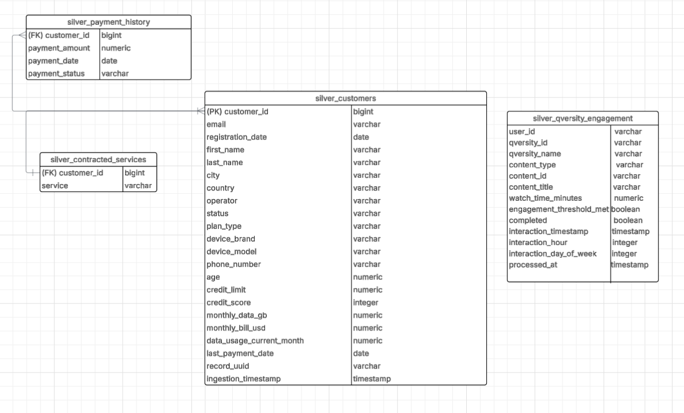

# Qversity Data Project – Mikaela Scotti

## Participante
- **Nombre:** Mikaela Scotti  
- **Email:** mikaelascotti10@gmail.com

## Overview

Este proyecto implementa un pipeline completo de datos utilizando la arquitectura Medallion (Bronze, Silver, Gold) sobre un dataset personalizado de telecomunicaciones. El pipeline utiliza Docker, PostgreSQL y Apache Airflow para la orquestación y dbt para la transformación y modelado de datos.

## BRONZE Layer

La Bronze Layer representa la primera etapa de la arquitectura, centrada en la ingestión y almacenamiento de los datos en su estado original. Esto asegura la conservación íntegra de la información para las etapas posteriores del pipeline.

### ¿Qué realiza esta capa?

- **Orquestación automatizada:**  
  Un DAG de Apache Airflow ejecuta secuencialmente los siguientes pasos:
    1. Creación de la tabla `bronze_mobile_customers` en PostgreSQL.
    2. Descarga automática del dataset JSON desde un bucket público de Amazon S3.
    3. Carga de cada registro del JSON en la base, manteniendo el formato original mediante un campo `raw_json`.
- **Persistencia confiable:**  
  Cada registro se almacena junto con un timestamp de ingestión, permitiendo trazabilidad y auditoría.
- **Entorno controlado:**  
  Todo el proceso corre en un entorno Docker Compose, lo que garantiza consistencia, portabilidad y facilidad de uso.

### Estado de la etapa Bronze

- El entorno Docker está correctamente configurado y operativo.
- El DAG de Airflow ejecuta todo el flujo sin errores.
- Los datos del JSON quedan almacenados en PostgreSQL en la tabla `bronze_mobile_customers`, listos para la siguiente etapa (Silver Layer).

---

## SILVER Layer

La **Silver Layer** representa la segunda etapa del pipeline, donde los datos son limpiados, normalizados y estructurados para su uso analítico. En esta fase, se eliminan inconsistencias, duplicados y nulos en campos clave, y se asegura la calidad de los datos mediante tests automáticos en dbt.

### ¿Qué realiza esta capa?

* **Transformación reproducible:**
  Todas las transformaciones son gestionadas con dbt, versionadas y orquestadas en Docker para máxima reproducibilidad y control.

* **Limpieza y flatten:**

  * Se “flatten” todos los campos anidados y arrays del JSON original, convirtiéndolos en columnas simples.
  * Se normalizan estructuras como `contracted_services` y `payment_history`, generando una fila por cada servicio o pago asociado a un cliente.
  * Se estandarizan los formatos de fechas y tipos numéricos para evitar inconsistencias.

* **Eliminación de inconsistencias:**

  * Se eliminan registros con campos críticos nulos o vacíos (`customer_id`, `registration_date`, `email`, etc.).
  * Se remueven duplicados utilizando claves naturales y el timestamp de ingestión.
  * **Integridad referencial:**
    Los modelos de pagos y servicios solo incluyen clientes válidos existentes en la tabla `silver_customers`, garantizando la consistencia entre tablas y evitando datos huérfanos.

* **Normalización de Status:**
* Todos los valores de la columna `status` se normalizaron a inglés en minúsculas (`active` `inactive`, `suspended`, `unknown`), unificando distintos formatos originales del JSON. Esta normalización evita ambigüedades y garantiza que los análisis y tests sean precisos y coherentes.

* **Control de calidad automatizado:**

  * Todos los modelos Silver cuentan con tests automáticos definidos en `schema.yml`, que verifican:

    * Unicidad y no nulos en campos clave.
    * Rangos válidos en montos (`payment_amount`).
    * Integridad relacional entre tablas (`relationships`/foreign keys).
    * Que no existan strings vacíos donde no corresponde.
  * Todos los tests de calidad se ejecutan y pasan exitosamente.

#### Modelos Silver principales

`silver_customers` - Clientes deduplicados y limpios, tabla maestra para la etapa Silver.
`silver_contracted_services` - Servicios contratados por cliente (1 fila por servicio y cliente).
`silver_payment_history` - Historial de pagos, normalizado (1 fila por pago y cliente).
`silver_qversity_engagement` - Interacciones con contenidos, enriquecidas y validadas.

### Estado de la etapa Silver

* Todos los modelos Silver se crean exitosamente en PostgreSQL.
* Todos los tests automáticos de dbt pasan sin errores.
* La capa Silver está lista para el análisis avanzado y la construcción de métricas en la etapa Gold.

#### Diagrama ERD


https://lucid.app/lucidchart/82ca83a3-d595-4a8c-a1cb-4baec92ffca6/edit?viewport_loc=405%2C43%2C4782%2C2491%2C0_0&invitationId=inv_8d9559e0-486d-4960-949c-f542ec1af690

---

## GOLD Layer
## Overview

La capa GOLD representa el nivel más alto del pipeline de datos, donde los datos limpios y estructurados de la capa Silver se transforman en métricas clave, reportes y vistas diseñadas para responder preguntas de negocio y tomar decisiones estratégicas. Todos los modelos Gold fueron generados en dbt y validados automáticamente, garantizando calidad y consistencia en cada métrica entregada.

## Business Questions Answered

La capa GOLD responde a todas las preguntas de negocio requeridas en la consigna del proyecto, incluyendo:

* ARPU (Average Revenue Per User) por tipo de plan.
* Revenue por ubicación geográfica.
* Revenue por segmento de cliente.
* Distribución de clientes por ubicación, plan, operador y credit score.
* Popularidad de marcas de dispositivos y servicios contratados.
* Porcentaje de clientes con problemas de pago.
* Tendencias de adquisición de clientes en el tiempo y por operador.
* Combinaciones de servicios más populares y que generan mayor revenue.
* Comparación de media y mediana de revenue mensual por usuario, plan y operador.

Cada una de estas preguntas tiene un modelo Gold asociado en la carpeta `/models/gold/`, con la lógica y el SQL correspondiente.

## Principales Decisiones de Negocio

**Exclusión de datos faltantes críticos:**
Se excluyeron del análisis en la capa Silver y Gold todos los registros que presentaban datos nulos o inválidos en campos críticos como customer_id, registration_date, email, credit_score, age o monthly_bill_usd. Esta decisión garantiza que todas las métricas y reportes reflejen únicamente información confiable y relevante, evitando distorsiones por registros incompletos o de baja calidad.

**Tratamiento de outliers y validaciones básicas:**
Se filtraron registros con valores extremos o no realistas en los campos de edad (age entre 0 y 120), revenue (monthly_bill_usd mayor a 10,000 o menor a 0), y credit score (entre 300 y 900).
Estos filtros eliminan potenciales errores de carga y aseguran que los análisis reflejen la realidad operativa del negocio, descartando casos no representativos.

**Segmentación de Credit Score:**
Se definieron cuatro rangos de credit score: muy bajo (<400), bajo (400–499), medio (500–699) y alto (700+). Esta segmentación permite identificar clientes de mayor riesgo, facilitando estrategias de gestión y retención focalizadas sobre los segmentos más críticos. Los cortes se eligieron alineados con estándares crediticios internacionales y para simplificar la comunicación y el análisis.

**Selección de periodos mensuales para análisis de tendencias:**
Las métricas temporales y tendencias se agrupan por mes utilizando date_trunc('month', ...). El análisis mensual ofrece una perspectiva estable para la toma de decisiones y evita la volatilidad de los datos diarios o la baja granularidad de los datos anuales.

**Identificación de clientes activos con campo calculado**
Se agregó un campo booleano is_active para identificar clientes actualmente activos, permitiendo filtrar las métricas y análisis para la cartera efectiva de la compañía y evitar que bajas o suspendidos distorsionen las métricas clave.

**Identificación de clientes nuevos**
Se agregó una columna is_new_customer para distinguir clientes que ingresaron en los últimos 6 meses, facilitando el análisis de tendencias de adquisición y retención de nuevos usuarios.

**Segmentación por rangos de edad**
Se implementó una segmentación por rangos de edad para facilitar el análisis de tendencias y métricas clave según grupos etarios, permitiendo detectar diferencias significativas en el comportamiento de consumo o morosidad entre jóvenes y adultos.

**Definición de Revenue y ARPU:**
Se utilizó la columna `monthly_bill_usd` como proxy de ingreso mensual (ARPU), ya que refleja el monto facturado a cada usuario. Esto permite comparar usuarios, planes y segmentos de manera directa y estandarizada.

**Priorización de integridad referencial:**
Las tablas derivadas de pagos (silver_payment_history) y servicios contratados (silver_contracted_services) incluyen únicamente clientes válidos presentes en la tabla principal silver_customers.Esto asegura consistencia y evita la presencia de datos huérfanos o relaciones inválidas, facilitando análisis correctos y joins seguros entre entidades

**Limpieza y Robustez de las Métricas:**
Se filtraron de los modelos Gold los registros con datos faltantes críticos (por ejemplo, clientes sin credit score, revenue o fecha de registro) para asegurar que las métricas reflejen solo información confiable y útil para el análisis de negocio.

**Calidad y Tests:**
Todos los modelos Gold están validados con tests de calidad en dbt (`not_null`, `accepted_values`, relaciones, etc.), garantizando que los datos sean consistentes y que los resultados sean reproducibles y auditables.

---

## Quick Start
1. **Clonar este repositorio y navega a la carpeta principal del proyecto:**
   ```bash
   git clone <qversity-data-2025-montevideo-mikaela-scotti>
   cd <qversity-data-2025-montevideo-mikaela-scotti>
   ```
2. **Levantar el entorno completo con Docker Compose:**
   ```bash
   docker compose up -d
   ```

3. **Accede a la interfaz de Airflow** (usualmente en [http://localhost:8095](http://localhost:8095))
   Usuario y contraseña: `admin` / `admin`.

## Run pipeline
Desde Airflow:
1. **Cargar los datos Bronze:**
   * Corre el DAG para Bronze (bronze_ingest.py).
2. **Transforma a Silver:**
   * Corre el DAG `silver_pipeline`.
3. **Transforma a Gold:**
   * Corre el DAG `gold_pipeline`.

## Run tests
dbt test


